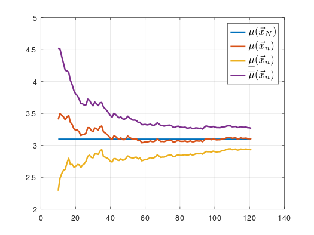
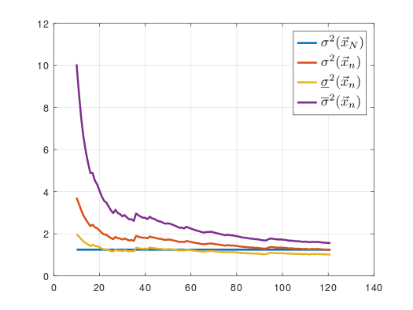

# Математическая статистика 
## Вариант №14
Лектор: Власов П.А.

Семинарист: Саркисян П.С.

- РК 2 писали в конце мая, теория чисто по лекциям, там только 3-го вопроса не хватает.
- 3 лабораторную не успели выдать, единственный реп, где видел её - https://github.com/V1kos1k/iu7_mathematical_statistics

Долги досдавали спокойно весь июнь

## ЛР №1

## ЛР №2

Всем успехов)